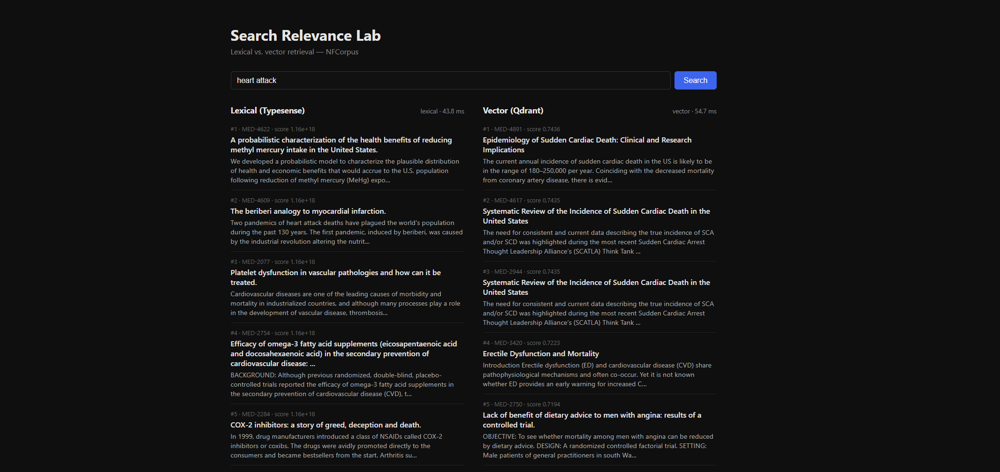

# Search Relevance Lab

A multi-backend search evaluation platform comparing lexical (Typesense), vector (Qdrant), and hybrid retrieval across a real corpus, with retrieval-quality metrics (nDCG, MRR, recall@k) computed against stored relevance judgments.

**Status:** Phase 3 — evaluation harness: every dataset query scored against qrels with nDCG / MRR / recall@k / precision@k, per-query and aggregate results persisted, latency tracked, and a results UI for run history, comparison, and per-query drill-down. (Phase 4 adds hybrid fusion.)



The comparison UI for `heart attack`: lexical (Typesense) matches the literal
tokens, while vector (Qdrant) returns the semantic cluster — sudden cardiac
death, angina — that shares few of the query's words. With the model warm, the
two backends have comparable latency (~44ms vs. ~55ms).

## Services

| Service     | Description                                          | Port |
|-------------|------------------------------------------------------|------|
| `postgres`  | System of record: documents, queries, qrels          | 5432 |
| `typesense` | Lexical search backend                               | 8108 |
| `qdrant`    | Vector search backend                                | 6333 |
| `api`       | FastAPI — `/health`, `/search`, `/config`, eval read endpoints (`/runs`, compare, drill-down) | 8000 |
| `web`       | Next.js — comparison UI + eval results pages (`/runs`) | 3000 |
| `indexer`   | One-shot tool: ingest corpus, build both indexes     | —    |
| `eval`      | Local harness (uv, not in compose): runs queries, scores, persists | —    |

## Corpus

[BEIR / NFCorpus](https://ir-datasets.com/beir.html#beir/nfcorpus) — a medical IR benchmark (PubMed abstracts, layman questions from NutritionFacts.org). We load the **test** split:

| | Count |
|---|---|
| Documents | 3,633 |
| Queries | 323 |
| Relevance judgments (qrels) | 12,334 |

Qrels are **graded** (0 / 1 / 2), which Phase 3's nDCG depends on.

## Architecture

```
host (one-time):  ir_datasets ──► ./data/ir_datasets   (NFCorpus cache)
                  bge-small   ──► ./data/hf_cache       (model weights)
                       │ bind-mounted into containers
                       ▼
indexer  ingest.py        ──► Postgres   (documents, queries, qrels)
         index_lexical.py ──► Postgres ─► Typesense   (title, text searchable)
         index_vector.py  ──► Postgres ─► encode ─► Qdrant   (384-dim, cosine)

api  GET /search?q=&backend=lexical|vector&k=10
        lexical: Typesense query
        vector:  embed query ─► Qdrant search
        ─► normalized response { doc_id, title, snippet, score, rank } + latency_ms

web  server-fetches BOTH backends ─► renders two columns side by side
```

The embedding model and dimensions are configured via `EMBEDDING_MODEL` / `EMBEDDING_DIM` (env), not hardcoded — they can be swapped without code changes.

## Evaluation (Phase 3)

The harness (`services/eval/`) runs every test query through each backend's `/search`, scores the ranked results against the qrels with pure, type-hinted metric functions, and persists per-query and aggregate results to Postgres. The metrics are validated against `pytrec_eval` (trec_eval's C implementation) over 100 randomized cases per metric, so the numbers are trustworthy by construction.

```bash
. ./scripts/load-env.ps1        # load DB creds into the shell (PowerShell)
cd services/eval
uv run pytest                   # metric unit + fuzz-validation tests
uv run python runner.py         # run eval for both backends, persist results
```

Results land in the `eval_runs` (aggregates, latency p50/p95, git sha) and `eval_results` (per-query metrics + ranked doc ids) tables, and are browsable at <http://localhost:3000/runs> — run history, two-run comparison sorted by per-query metric delta, and a drill-down showing both ranked lists with relevant docs highlighted.

### Results (NFCorpus test, k=10)

| Backend | nDCG@10 | MRR | recall@10 | P@10 | latency p50 |
|---|---|---|---|---|---|
| Lexical (Typesense, BM25-style + stemming) | 0.224 | 0.411 | 0.097 | 0.152 | ~110 ms |
| Vector (Qdrant, bge-small-en-v1.5) | 0.343 | 0.529 | 0.162 | 0.256 | ~880 ms |

Published BEIR BM25 baseline for NFCorpus is nDCG@10 ≈ **0.325**. Vector lands on its expected baseline; lexical trails BM25 because Typesense's `text_match` is not canonical Okapi BM25 (different scoring; enabling stemming closed only a small part of the gap). See [`docs/findings.md`](docs/findings.md) for the full write-up.

## Quick start

### 1. Host prerequisites (one-time)

The container network is locked down, so the dataset and model are downloaded on the host into `./data/` (bind-mounted into the containers).

```bash
cp .env.example .env

python -m venv .venv-host
# Windows:  .venv-host\Scripts\Activate.ps1
# Unix:     source .venv-host/bin/activate
pip install ir-datasets sentence-transformers

python scripts/host_check.py           # NFCorpus  -> ./data/ir_datasets
python scripts/host_download_model.py   # bge-small -> ./data/hf_cache
```

### 2. Bring up infrastructure and build indexes

```bash
docker compose up -d postgres typesense qdrant
docker compose build
make index          # ingest -> index-lexical -> index-vector
```

### 3. Start the app

```bash
docker compose up -d api web
```

Open <http://localhost:3000> and search (try `heart attack` to see lexical token-matching vs. vector semantic retrieval).

## Integration checklist (fresh slate)

Verifies the whole pipeline from empty volumes. Note: `down -v` wipes the database **volumes** but not `./data/` (host dirs), so the dataset/model are not re-downloaded.

1. `docker compose down -v` — remove containers **and** named volumes.
2. `docker compose up -d postgres typesense qdrant` — wait for healthy.
3. `docker compose build`
4. `make ingest` — expect `3633 docs, 323 queries, 12334 qrels`.
5. `make index-lexical` — expect `Typesense reports 3633 documents`.
6. `make index-vector` — expect `Qdrant reports 3633 points`.
7. `docker compose up -d api web`
8. `curl "http://localhost:8000/search?q=heart%20attack&backend=vector&k=5"` — normalized results.
9. Open <http://localhost:3000>, search, confirm both columns render.

## Make targets

| Target | Action |
|---|---|
| `make up` / `make down` | start / stop the stack |
| `make index` | ingest + build both search indexes |
| `make ingest` / `make index-lexical` / `make index-vector` | individual pipeline steps |
| `make health` | print API health JSON |
| `make eval-test` / `make eval-lint` | run the eval harness tests / lint |
| `make logs` / `make ps` | tail logs / list containers |
